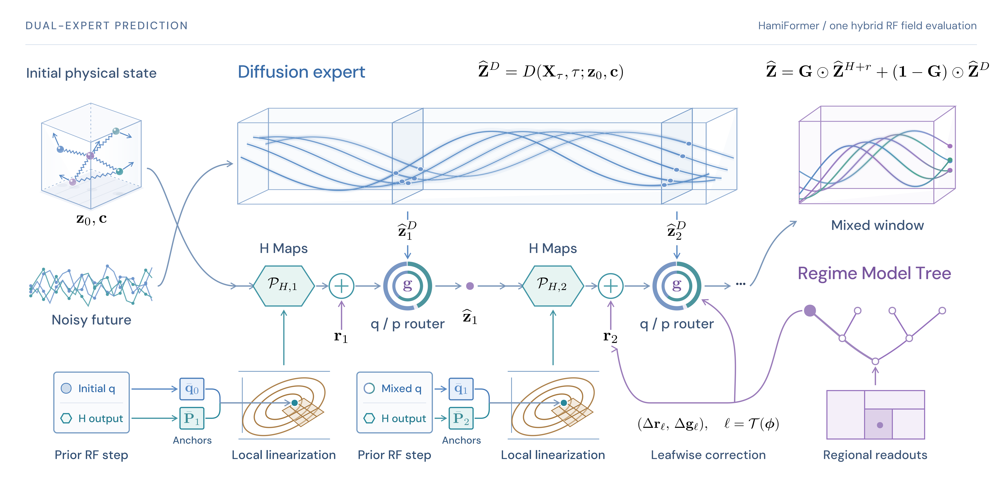

# HamiFormer



Dual-Expert Diffusion Fields with Affine Symplectic Maps

[Project page](https://hamiformer.github.io/) · [HamiBalls datasets](https://huggingface.co/datasets/HamiFormer/Hamiballs) · [Pretrained weights](https://huggingface.co/HamiFormer/HamiFormer-Assets)

## Setup

Use Python 3.10–3.12, PyTorch 2.5.1 and a compatible CUDA environment. Run commands from this directory.

```sh
python -m pip install -e ".[test,data,analysis]"
python -m pytest
python run.py --help
```

## Code layout

`src/hamiformer/models/hamiformer.py` exposes HamiFormer. The `models/` package contains its experts and correction modules; `baselines/` contains PhysiFormer, DiT, Transformer-AR and HG-DPF components. Training, inference, evaluation, integrators, data processing and visualization have separate packages. Dataset configurations are grouped under `configs/hamiballs1/` and `configs/hamiballs2/`. The `scripts/` directory provides command entry points.

## Evaluation

The released data files contain `train` and `validation` HDF5 groups. Model files contain tensor state dictionaries.
Set `DATA` to a downloaded HDF5 file and `WEIGHTS` to the directory containing the downloaded `.pt` files.

```sh
python run.py evaluate --dataset h1 --data DATA/hamiballs1.h5 --weights WEIGHTS --method ours --output results/h1_ours
python run.py evaluate --dataset h2 --data DATA/hamiballs2.h5 --weights WEIGHTS --method ours --output results/h2_ours
```

H1 methods are `ours`, `physiformer`, and `hgdpf`. H2 methods are `ours`, `physiformer`, `dit`, `transformer_ar1`, and `transformer_ar4`. Evaluation computes Table 1 pooled/contact/continuous MSE and Table 2 disjoint-interval MSE, using 192-edge continuation and two noise seeds. `--limit` controls the source count.

For H1 Ours, select an integrator with `--solver explicit_euler`, `symeuler2`, `plas`, `plas_s`, `plas_dc`, `plas_dc_f`, `plas_dc_s`, or `plas_dlr`. The default is `plas`. H2 uses PLAS. CUDA evaluation uses batched window construction, compiled candidate application and mixed-feedback scans. Run different solver configurations in separate processes. The first batch includes compilation and graph capture; measure synchronized, warmed batches for runtime comparisons. The H1 timing configuration is batch 64, 48 edges per window, 20 RF steps and FP32 with TF32 disabled.

## Data and training

Pre-generated HDF5 datasets are available from the [HamiBalls repository](https://huggingface.co/datasets/HamiFormer/Hamiballs); the commands below regenerate the datasets and train models from scratch.

H1 generation uses the four configurations `configs/generator/hamiballs_canonical_v2_seed{40,41,42,43}.yaml`, followed by `pack-h1`. H2 uses `configs/generator/hamiballs2_frozen_v2_g1_khalf_.yaml`.

```sh
python run.py generate-h1 --config configs/generator/hamiballs_canonical_v2_seed42.yaml --execute
python run.py pack-h1 --root data/hamiballs_canonical_v2 --staging-root data/packing_work
python run.py generate-h2 --config configs/generator/hamiballs2_frozen_v2_g1_khalf_.yaml --generate
python run.py export-hdf5 --dataset h1 --root data/hamiballs_canonical_v2 --output data/hamiballs1.h5
python run.py export-hdf5 --dataset h2 --root data/hamiballs2_3d_sparse_springs_g1_khalf_v2 --output data/hamiballs2.h5
python run.py train-joint --dataset h1 --config configs/hamiballs1/base.json --output-dir outputs/hami1_base
python run.py train-joint --dataset h2 --config configs/hamiballs2/physiformer.yaml --h-config configs/hamiballs2/hamiltonian.yaml --output-dir outputs/hami2_joint
python run.py train-physiformer-h1 --config configs/hamiballs1/base.json --output-dir outputs/hami1_physiformer
```

Joint training updates D and continuous H for 50,000 steps. H2 uses the endpoint H objective from step 40,001. H1 downstream stages are `prepare-h1-training`, `train-h1-r`, `train-h1-gate`, and `train-h1-final`; H2 uses `train-h2`. Baseline training entry points are listed by `run.py --help`. Each command exposes its input arguments with `--help`.

`export-hdf5` writes the train and validation groups. It preserves full 193-frame physical-coordinate episodes, canonical momentum, object attributes and source order. H1 requires the generated `source_seed40` through `source_seed43` manifests and event files; H2 reads episode shards and their contact labels, retaining masks and spring graphs. Existing output files are not overwritten.

H1 contact labels include every positive-impulse substep, including sustained contacts. When a generated episode has no `frame_contact` array, export replays the scene using its physical seed and accepted sampling attempt, checks exact agreement with the saved trajectory, and records contacts with impulse/substep-duration above `1e-12`. Install the `data` dependencies for this operation.

## Integrators and visualization

`hamiformer.integrators.solver.Solver` provides `explicit_euler`, `symeuler2`, `plas`, `plas_s`, `plas_dc`, `plas_dc_f`, `plas_dc_s`, and `plas_dlr`. Its `step` accepts a scalar energy function, a canonical `[q,p]` vector, a physical step size, and an optional anchor. Use one solver instance per physical edge and call `reset` at each sampling chunk. Sparse variants refresh every 16 distinct anchors by default; PLAS-DC-F freezes the initial affine jet. PLAS-DLR uses rank 2 and 4 diagonal probes. Rademacher and Gaussian probe directions remain fixed across steps and chunk resets for each state shape, device, dtype, and probe configuration. By default, directions use a local generator seeded with 42; a supplied generator controls their initial draw.

`Solver.install_h1` connects all eight batched methods to the prediction pipeline used by `evaluate`. Dense curvature is constructed in batches of 512 anchors; DLR uses batches of 128 anchors and Hessian-vector products. PLAS-DC and PLAS-DC-S accumulate defect corrections in FP64 and return FP32 states; PLAS-DC-F uses FP32 correction algebra. The Euler methods retain sequential physical-edge updates with batched first derivatives.

For independent DLR window use, `backend = Solver('plas_dlr').bind_dlr(hamiltonian, attr_scale, step_size)` exposes `backend.build(source_q, target_p, attrs)` and `backend.apply(factors, edge, previous)`. q/p tensors have shape `[batch, edges, objects, 2]`; previous states have shape `[batch, objects, 4]`. The Hamiltonian accepts flattened canonical q/p and normalized object context. Factors are shared across edge applications for the supplied anchor and rebuilt when the anchor changes. This path uses fixed probes, batched HVPs, QR and a rank-sized Woodbury solve, without constructing a dense Hessian or dense affine map. Use `compiled=False` for CPU execution.

```sh
python run.py error-figure --inputs results/h2_ours/trajectories.npz --labels Ours --output error.pdf
python run.py render-h1 --inputs results/h1_ours/trajectories.npz --labels Ours --output hami1.gif
```

`render-h1` uses central coil springs and dashed GT overlays. `render-h2` launches Blender 3.6 using `BLENDER` or the executable on `PATH`. Its JSON input supplies `positions` mapping display names to coordinates, `initial`, `attrs`, `colors`, and spring `edges`; the second argument is the output directory. The renderer uses the paper's camera, acrylic walls, restitution-dependent sphere materials and metallic helical springs. Static coordinates produce PNG; frame sequences produce GIF with a shared palette and normal-speed timing at 30 fps.

Project code uses the [MIT license](LICENSE). Third-party attribution is listed in [THIRD_PARTY_NOTICES.md](THIRD_PARTY_NOTICES.md).
